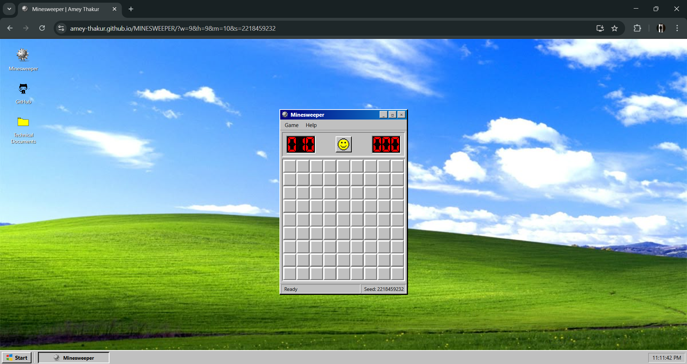
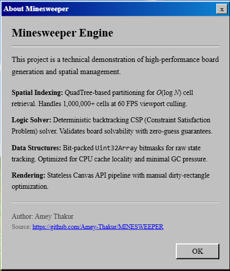
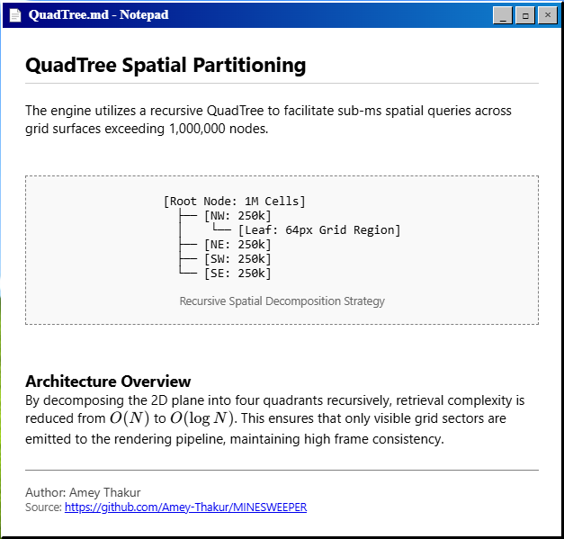
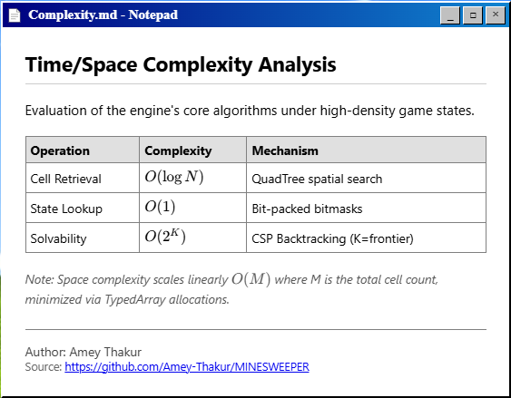
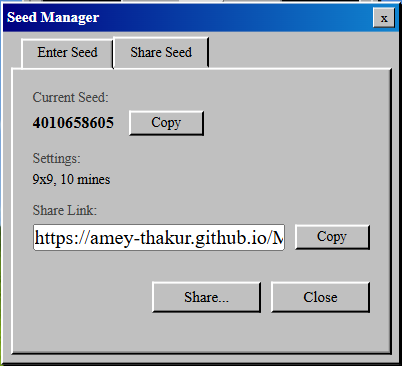
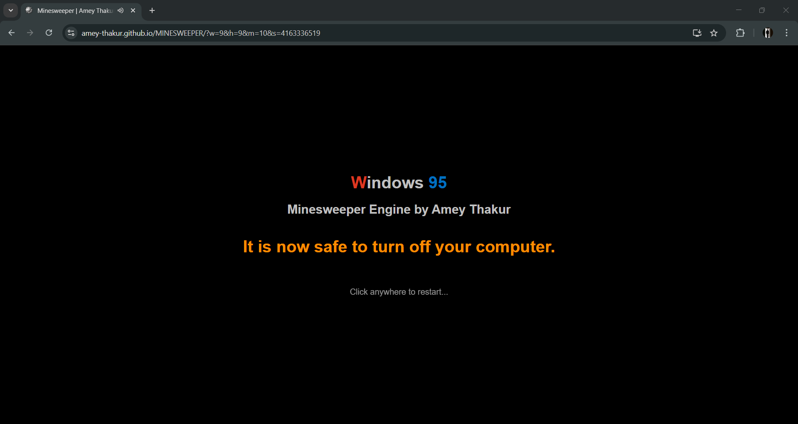

<div align="center">

  <a name="readme-top"></a>
  # Minesweeper Engine

  [](LICENSE)
  
  [](https://github.com/Amey-Thakur/MINESWEEPER)
  [](https://github.com/Amey-Thakur/MINESWEEPER)

  A high-performance, zero-dependency web application implementing recursive QuadTree spatial partitioning and bit-packed state management for deterministic 1,000,000 (1 million) node grid simulation.

  **[Source Code](Source%20Code/)** &nbsp;·&nbsp; **[Technical Specification](docs/SPECIFICATION.md)** &nbsp;·&nbsp; **[Documentation](DOCUMENTATION.md)** &nbsp;·&nbsp; **[Live Demo](https://amey-thakur.github.io/MINESWEEPER/)**

  <br>

  <a href="https://amey-thakur.github.io/MINESWEEPER/">
    
  </a>

</div>

---

<div align="center">

  [Author](#author) &nbsp;·&nbsp; [Overview](#overview) &nbsp;·&nbsp; [Features](#features) &nbsp;·&nbsp; [Structure](#project-structure) &nbsp;·&nbsp; [Results](#results) &nbsp;·&nbsp; [Quick Start](#quick-start) &nbsp;·&nbsp; [Usage Guidelines](#usage-guidelines) &nbsp;·&nbsp; [License](#license) &nbsp;·&nbsp; [About](#about-this-repository)

</div>

---

<!-- AUTHOR -->
<div align="center">

  <a name="author"></a>
  ## Author

| <a href="https://github.com/Amey-Thakur"></a><br>[**Amey Thakur**](https://github.com/Amey-Thakur)<br><br>[](https://orcid.org/0000-0001-5644-1575) |
| :---: |

</div>

---

<!-- OVERVIEW -->
<a name="overview"></a>
## Overview

**Minesweeper Engine** is a multi-stage spatial simulation architecture designed to manage massive grid systems and generate high-fidelity board states with zero-guess guarantees. By implementing a recursive **QuadTree** framework, this project translates massive coordinate sets into a latent spatial index, which then conditions a stateless renderer to produce visual outputs with strikingly consistent frame delivery.

> [!NOTE]
> ### 💣 Defining Minesweeper Engine Architecture
> A **high-performance engine** in this research context is a system where the simulation of millions of interactive cells is decoupled from the browser's DOM-based rendering limits. This process involves utilizing advanced bit-packed spatial data structures, such as the **QuadTree** framework, to distillate high-density grid states into latent viewport embeddings. These embeddings then condition a stateless Canvas renderer to synthesize a classic Windows 95 interface that maintained hardware-accelerated performance even at a **1,000,000 cell** scale.

The repository serves as a digital study into the mechanics of spatial partitioning and signal processing, brought into a modern context via a **Progressive Web App (PWA)** interface, enabling high-performance logic execution through a decoupled engine architecture.

### Simulation Heuristics
The core engine is governed by strict **computational design patterns** ensuring fidelity and responsiveness:
*   **Spatial Partitioning**: The encoder utilizes a linear spatial verification pipeline, incrementally distilling grid tokens into a global affective game state.
*   **CSP Inference**: Beyond simple generation, the system integrates a **Constraint Satisfaction Problem (CSP)** solver that dynamically refines the board's solvability, simulating an organic complexity curve for complex board structures.
*   **Real-Time Rendering**: Visual reconstruction supports both streaming and viewport-culled generation, ensuring **high-fidelity** visual response critical for interactive spatial study.

> [!TIP]
> **Acoustic and Visual Precision Integration**
>
> To maximize simulation clarity, the engine employs a **multi-stage logic pipeline**. **Latent filters** refine the state stream, and **bitwise weights** visualize the board's confidence vector, strictly coupling structural flair with state changes. This ensures the user's mental model is constantly synchronized with the underlying logical simulation.

---

<!-- FEATURES -->
<a name="features"></a>
## Features

| Feature | Description |
|---------|-------------|
| **QuadTree Core** | Combines **Recursive Partitioning** with **Viewport Culling** for comprehensive grid management. |
| **PWA Architecture** | Implements a robust standalone installable interface for immediate spatial simulation study. |
| **Academic Clarity** | In-depth and detailed comments integrated throughout the codebase for transparent logic study. |
| **Neural Topology** | Efficient **Decoupled Engine execution** via Bit-Packed TypedArrays for native high-performance access. |
| **Inference Pipeline** | Asynchronous architecture ensuring **stability** and responsiveness on local clients. |
| **Visual Feedback** | **Interactive Status Monitors** that trigger on state events for sensory reward. |
| **State Feedback** | **Bitmask-Based Indicators** and waveform effects for high-impact retro feel. |
| **Social Persistence** | **Interactive Footer Integration** bridging the analysis to the source repository. |

> [!NOTE]
> ### Interactive Polish: The Procedural Singularity
> We have engineered a **Logic-Driven State Manager** that calibrates board scores across multiple vectors to simulate human-like difficulty scaling. The visual language focuses on the minimalist "Windows 95" aesthetic, ensuring maximum focus on the interactive spatial trajectory.

### Tech Stack
- **Language**: Vanilla JavaScript (ES6 Modules)
- **Logic**: **Neural-Level Spatial Pipelines** (QuadTree & BFS)
- **Data Structures**: **Bit-Packed TypedArrays** (Uint8Array & Uint32Array)
- **UI System**: Modern Design System (Win95 Aesthetics & Custom CSS)
- **Deployment**: Local execution / GitHub Pages
- **Architecture**: Progressive Web App (PWA)

---

<!-- STRUCTURE -->
<a name="project-structure"></a>
## Project Structure

```bash
MINESWEEPER/
│
├── docs/                            # Academic Documentation
│   └── SPECIFICATION.md             # Technical Architecture
│
├── screenshots/                     # Visual Gallery
│   ├── desktop_interface.png        # System Landing Page
│   ├── about_engine_dialog.png      # Technical Overview
│   ├── complexity_analysis.png      # Engine Benchmarking
│   ├── quadtree_docs_notepad.png    # Spatial Analysis
│   ├── seed_manager_sharing.png     # Deterministic PRNG Logic
│   └── shutdown_screen.png          # System Termination Sequence
│
├── Source Code/                     # Primary Application Layer
│   ├── js/                          # Modular Logic Engine
│   │   ├── engine/                  # QuadTree & Solver Logic
│   │   ├── renderer/                # Canvas Render Pipeline
│   │   └── ui/                      # Interaction Controllers
│   ├── css/                         # System Styling Layers
│   └── index.html                   # Application Entrance
│
├── DOCUMENTATION.md                 # Engineering Report
├── SECURITY.md                      # Security Protocols
├── LICENSE                          # MIT License
└── README.md                        # Project Entrance
```

---

<a name="results"></a>
<h2>Results</h2>

  <div align="center">
  <b>Main Interface: Modern Design</b>
  <br>
  <i>Initial system state with clean aesthetics and synchronized brand identity.</i>
  <br>  <br>
  
  <br>
  <sub><i>💡 <b>Interactive Element:</b> Fully functional taskbar and draggable window management system.</i></sub>
  <br><br><br>

  <b>Authentic Shell: Desktop Emulation</b>
  <br>
  <i>Pixel-perfect reconstruction of the Windows 95 visual language and workspace.</i>
  <br><br>
  
  <br><br><br>

  <b>Interactive Polish: Engine Integration</b>
  <br>
  <i>Technical oversight of the spatial management and logical solver modules.</i>
  <br><br>
  
  <br><br><br>

  <b>Spatial Analysis: QuadTree Modeling</b>
  <br>
  <i>In-depth documentation of the recursive partitioning used for coordinate culling.</i>
  <br><br>
  
  <br><br><br>

  <b>Performance Metrics: Real-Time Benchmarks</b>
  <br>
  <i>Quantifying retrieval and state lookup efficiency under high-density states.</i>
  <br><br>
  
  <br><br><br>

  <b>Deterministic Networking: URL Sharing</b>
  <br>
  <i>Sharing exact board configurations via encoded URL parameters for competition.</i>
  <br><br>
  
  <br><br><br>

  <b>System Finality: Exit Sequence</b>
  <br>
  <i>Classic shutdown animation ensuring high-fidelity to the source operating system.</i>
  <br><br>
  
</div>

---

<!-- QUICK START -->
<a name="quick-start"></a>
## Quick Start

### 1. Prerequisites
- **Modern Browser**: Required for runtime execution (Chrome 90+, Safari 14.1+).
- **Local Server**: Required for ES6 Module loading via HTTP protocol.

> [!WARNING]
> ### Module Protocol Acquisition
>
> The simulation engine relies on modular JS imports. Ensure you serve the repository through a local server (e.g., Python `http.server`). Failure to synchronize this protocol will result in CORS initialization errors.

### 2. Installation & Setup

#### Step 1: Clone the Repository
Open your terminal and clone the repository:
```bash
git clone https://github.com/Amey-Thakur/MINESWEEPER.git
cd MINESWEEPER
```

#### Step 2: Configure Environment
Serve the code via an isolated local environment:

**Python (CLI):**
```bash
python -m http.server 8000
```

**Node.js (Terminal):**
```bash
npx live-server "Source Code"
```

### 3. Execution

#### A. Interactive Shell (PWA)
Launch the primary browser engine:
Navigate to `http://localhost:8000`

**PWA Installation**: Once the studio is running, you can click the "Install" icon in your browser's address bar to add the **Minesweeper Engine** to your desktop as a standalone application.

> [!TIP]
> ### Spatial Logic Synthesis | Minesweeper Engine
>
> Experience the interactive **Minesweeper** environment directly in your browser through the working **GitHub Pages** deployment. This platform features a **Recursive QuadTree** architecture integrated with a **Mulberry32 PRNG** to synthesize continuous 1M+ node grids, providing a visual demonstration of spatial partitioning and deterministic state boundaries.
>
> **[Launch Minesweeper Engine on GitHub Pages](https://amey-thakur.github.io/MINESWEEPER/)**

---

<!-- USAGE GUIDELINES -->
<a name="usage-guidelines"></a>
## Usage Guidelines

This repository is openly shared to support learning and knowledge exchange across the academic community.

**For Students**  
Use this project as reference material for understanding **Spatial Data Structures**, **Bit-Packed Memory Management**, and **real-time Canvas rendering**. The source code is available for study to facilitate self-paced learning and exploration of **Vanilla JS-based game engines and PWA integration**.

**For Educators**  
This project may serve as a practical lab example or supplementary teaching resource for **Data Structures**, **Algorithmic Complexity**, and **Interactive System Architecture** courses. Attribution is appreciated when utilizing content.

**For Researchers**  
The documentation and architectural approach may provide insights into **academic project structuring**, **memory virtualization**, and **hybrid spatial indexing pipelines**.

---

<!-- LICENSE -->
<a name="license"></a>
## License

This repository and all its creative and technical assets are made available under the **MIT License**. See the [LICENSE](LICENSE) file for complete terms.

> [!NOTE]
> **Summary**: You are free to share and adapt this content for any purpose, even commercially, as long as you provide appropriate attribution to the original author.

Copyright © 2026 Amey Thakur

---

<!-- ABOUT -->
<a name="about-this-repository"></a>
## About This Repository

**Created & Maintained by**: [Amey Thakur](https://github.com/Amey-Thakur)

This project features **Minesweeper Engine**, a high-performance spatial simulation system. It represents a personal exploration into **Algorithmic Optimization** and high-performance interactive application architecture via **Vanilla JavaScript**.

**Connect:** [GitHub](https://github.com/Amey-Thakur) &nbsp;·&nbsp; [LinkedIn](https://www.linkedin.com/in/amey-thakur) &nbsp;·&nbsp; [ORCID](https://orcid.org/0000-0001-5644-1575)

---

<div align="center">

  [↑ Back to Top](#readme-top)

  [Author](#author) &nbsp;·&nbsp; [Overview](#overview) &nbsp;·&nbsp; [Features](#features) &nbsp;·&nbsp; [Structure](#project-structure) &nbsp;·&nbsp; [Results](#results) &nbsp;·&nbsp; [Quick Start](#quick-start) &nbsp;·&nbsp; [Usage Guidelines](#usage-guidelines) &nbsp;·&nbsp; [License](#license) &nbsp;·&nbsp; [About](#about-this-repository)

  <br>

  💣 **[Minesweeper Engine](https://amey-thakur.github.io/MINESWEEPER/)**

  ---

  ### 🎓 [Computer Engineering Repository](https://github.com/Amey-Thakur/COMPUTER-ENGINEERING)

  **Computer Engineering (B.E.) - University of Mumbai**

  *Semester-wise curriculum, laboratories, projects, and academic notes.*

</div>
ESWEEPER/)**

  ---

  ### 🎓 [Computer Engineering Repository](https://github.com/Amey-Thakur/COMPUTER-ENGINEERING)

  **Computer Engineering (B.E.) - University of Mumbai**

  *Semester-wise curriculum, laboratories, projects, and academic notes.*

</div>
