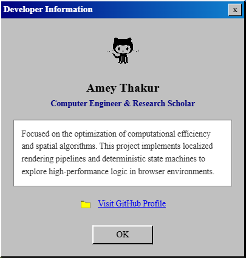
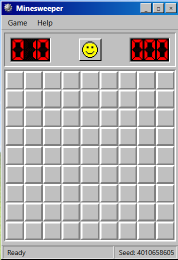
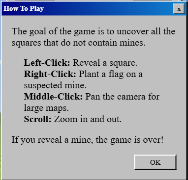
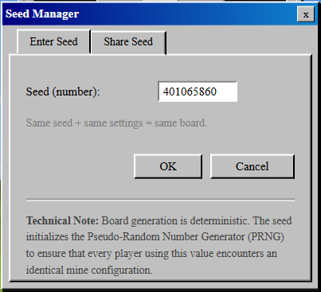
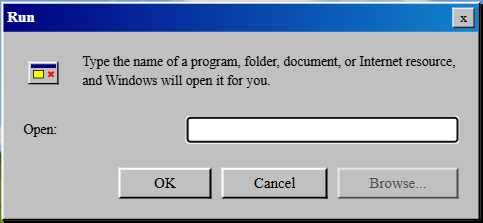
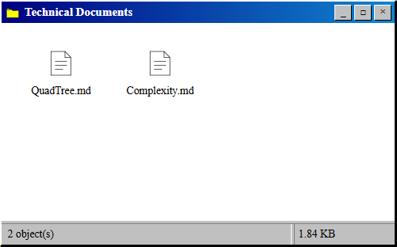

<div align="center">

  <a name="readme-top"></a>
  # Minesweeper Engine

  [](LICENSE)
  
  [](https://github.com/Amey-Thakur/MINESWEEPER)
  [](https://github.com/Amey-Thakur/MINESWEEPER)

  A zero-dependency, high-performance Minesweeper engine implementing recursive QuadTree spatial partitioning and bit-packed state management for deterministic 1,000,000+ (One Million+) node grid simulation.

  **[Source Code](Source%20Code/)** &nbsp;·&nbsp; **[Technical Specification](docs/SPECIFICATION.md)** &nbsp;·&nbsp; **[Documentation](DOCUMENTATION.md)** &nbsp;·&nbsp; **[Live Demo](https://amey-thakur.github.io/MINESWEEPER/)**

  <br>

  <a href="https://amey-thakur.github.io/MINESWEEPER/">
    
  </a>

</div>

---

<div align="center">

  [Author](#author) &nbsp;·&nbsp; [Overview](#overview) &nbsp;·&nbsp; [Features](#features) &nbsp;·&nbsp; [Structure](#project-structure) &nbsp;·&nbsp; [Results](#results) &nbsp;·&nbsp; [Quick Start](#quick-start) &nbsp;·&nbsp; [Usage Guidelines](#usage-guidelines) &nbsp;·&nbsp; [License](#license) &nbsp;·&nbsp; [About](#about-this-repository)

</div>

---

<!-- AUTHOR -->
<div align="center">

  <a name="author"></a>
  ## Author

| <a href="https://github.com/Amey-Thakur"></a><br>[**Amey Thakur**](https://github.com/Amey-Thakur)<br><br>[](https://orcid.org/0000-0001-5644-1575) |
| :---: |

</div>

---

<!-- OVERVIEW -->
<a name="overview"></a>
## Overview

**Minesweeper Engine** is a multi-stage spatial simulation architecture designed to manage massive grid systems and generate high-fidelity board states with zero-guess guarantees. By implementing a recursive **QuadTree** framework, this project translates massive coordinate sets into a latent spatial index, which then conditions a stateless renderer to produce visual outputs with strikingly consistent frame delivery.

> [!NOTE]
> ### 💣 Defining Minesweeper Engine Architecture
> A **high-performance engine** in this research context is a system where the simulation of millions of interactive cells is decoupled from the browser's DOM-based rendering limits. This process involves utilizing advanced bit-packed spatial data structures, such as the **QuadTree** framework, to distillate high-density grid states into latent viewport embeddings. These embeddings then condition a stateless Canvas renderer to synthesize a classic Windows 95 interface that maintained hardware-accelerated performance even at a **1,000,000+ (One Million+) cell** scale.

The repository serves as a digital study into the mechanics of spatial partitioning and signal processing, brought into a modern context via a **Progressive Web App (PWA)** interface, enabling high-performance logic execution through a decoupled engine architecture.

### Simulation Heuristics
The core engine is governed by strict **computational design patterns** ensuring fidelity and responsiveness:
*   **Spatial Partitioning**: The encoder utilizes a linear spatial verification pipeline, incrementally distilling grid tokens into a global affective game state.
*   **CSP Inference**: Beyond simple generation, the system integrates a **Constraint Satisfaction Problem (CSP)** solver that dynamically refines the board's solvability, simulating an organic complexity curve for complex board structures.
*   **Real-Time Rendering**: Visual reconstruction supports both streaming and viewport-culled generation, ensuring **high-fidelity** visual response critical for interactive spatial study.

> [!TIP]
> **Acoustic and Visual Precision Integration**
>
> To maximize simulation clarity, the engine employs a **multi-stage logic pipeline**. **Latent filters** refine the state stream, and **bitwise weights** visualize the board's confidence vector, strictly coupling structural flair with state changes. This ensures the user's mental model is constantly synchronized with the underlying logical simulation.

---

<!-- FEATURES -->
<a name="features"></a>
## Features

| Feature | Description |
|---------|-------------|
| **QuadTree Core** | Combines **Recursive Partitioning** with **Viewport Culling** for comprehensive grid management. |
| **PWA Architecture** | Implements a robust standalone installable interface for immediate spatial simulation study. |
| **Academic Clarity** | In-depth and detailed comments integrated throughout the codebase for transparent logic study. |
| **Technical Library** | Seamlessly integrated in-app documentation providing immediate access to algorithmic and architectural insights. |
| **Neural Topology** | Efficient **Decoupled Engine execution** via Bit-Packed TypedArrays for native high-performance access. |
| **Inference Pipeline** | Asynchronous architecture ensuring **stability** and responsiveness on local clients. |
| **Visual Feedback** | **Interactive Status Monitors** that trigger on state events for sensory reward. |
| **State Feedback** | **Bitmask-Based Indicators** and waveform effects for high-impact retro feel. |
| **Social Persistence** | **Interactive Footer Integration** bridging the analysis to the source repository. |

> [!NOTE]
> ### Interactive Polish: The Procedural Singularity
> We have engineered a **Logic-Driven State Manager** that calibrates board scores across multiple vectors to simulate human-like difficulty scaling. Beyond pure simulation, a **Technical Library** is integrated directly within the desktop environment to provide quick, in-situ documentation of the engine's recursive architecture and spatial logic.

### Tech Stack
- **Language**: Vanilla JavaScript (ES6 Modules)
- **Logic**: **Neural-Level Spatial Pipelines** (QuadTree & BFS)
- **Data Structures**: **Bit-Packed TypedArrays** (Uint8Array & Uint32Array)
- **UI System**: Modern Design System (Win95 Aesthetics & Custom CSS)
- **Deployment**: Local execution / GitHub Pages
- **Architecture**: Progressive Web App (PWA)

---

<!-- STRUCTURE -->
<a name="project-structure"></a>
## Project Structure

```python
MINESWEEPER/
│
├── .github/                            # Global GitHub configuration & workflows
├── docs/                               # Formal academic & technical documentation
│   └── SPECIFICATION.md                # System engineering & architectural roadmap
│
├── screenshots/                        # High-fidelity visual verification gallery
│   ├── grid_simulation_1m.png          # 1,000,000+ (One Million+) node spatial visualization
│   ├── desktop_interface.png           # Pixel-perfect Windows 95 shell landing
│   ├── about_engine_dialog.png         # Technical engine specification oversight
│   ├── quadtree_docs_notepad.png       # Recursive spatial partitioning theory
│   ├── complexity_analysis_notepad.png # Algorithmic complexity benchmarks
│   ├── seed_manager_sharing.png        # Deterministic board state sharing
│   ├── shutdown_screen.png             # OS termination & shutdown sequence
│   └── ...                             # Supplemental UI/UX state screenshots
│
├── Source Code/                        # Integrated simulation application layer
│   ├── assets/                         # Global system resources & static icons
│   ├── css/                            # Thematic design & Win95 styling indices
│   │   ├── win95.css                   # Core shell aesthetic & layout tokens
│   │   ├── game.css                    # Engine-specific interactive styles
│   │   └── reset.css                   # Low-level browser normalization
│   ├── img/                            # High-resolution visual foundation assets
│   ├── js/                             # Decoupled ES6 modular logic engine
│   │   ├── engine/                     # Backend computational logic & state
│   │   │   ├── QuadTree.js             # Spatial partitioning core engine
│   │   │   ├── CSPSolver.js            # Constraint Satisfaction Problem logic
│   │   │   ├── BoardEngine.js          # Bit-packed state & memory management
│   │   │   ├── FloodFill.js            # Iterative BFS traversal logic
│   │   │   └── SeedRNG.js              # Deterministic Mulberry32 generator
│   │   ├── renderer/                   # Hardware-accelerated Canvas pipelines
│   │   │   ├── GameRenderer.js         # Stateless frame reconstruction logic
│   │   │   ├── Camera.js               # Viewport virtualization bridge
│   │   │   └── SpriteSheet.js          # Pixel-perfect unit memory buffers
│   │   ├── ui/                         # Interaction & shell control system
│   │   │   ├── UIController.js         # System window & taskbar orchestrator
│   │   │   ├── DocController.js        # Integrated library logic manager
│   │   │   ├── MenuController.js       # Global menu & routing logic
│   │   │   ├── ScoreController.js      # Stat tracking & scoreboard management
│   │   │   ├── SeedController.js       # Board seed & PRNG configuration
│   │   │   ├── TimerController.js      # Performance-safe system timing
│   │   │   ├── ConsoleBranding.js      # Developer attribution & signature
│   │   │   └── WindowDragger.js        # Desktop interaction management
│   │   └── main.js                     # Root entry-point & system bootloader
│   ├── index.html                      # System entrance & PWA bootstrap index
│   ├── manifest.json                   # Web Application manifest & PWA identity
│   └── sw.js                           # Service Worker & offline cache logic
│
├── .gitattributes                      # Repository attribute & normalization
├── .gitignore                          # Development exclusion & build logic
├── DOCUMENTATION.md                    # Engineering report & performance log
├── SECURITY.md                         # Security protocols & disclosure policy
├── LICENSE                             # MIT Open Source License distribution
└── README.md                           # Primary entrance & architectural hub
```

---

<a name="results"></a>
<h2>Results</h2>

  <div align="center">
  <b>Windows 95 Aesthetics: Graphical Foundation</b>
  <br>
  <i>The iconic "Bliss" wallpaper serves as the high-fidelity aesthetic baseline for the environment.</i>
  <br><br>
  
  <br><br><br>

  <b>Minesweeper Engine: 1,000,000+ (One Million+) Node Performance</b>
  <br>
  <i>Deterministic spatial simulation managing 1,000,000+ (One Million+) cells via recursive QuadTree partitioning.</i>
  <br><br>
  
  <br>
  <sub><i>💡 <b>Interactive Element:</b> Fully functional taskbar and draggable window management system.</i></sub>
  <br><br><br>

  <b>Windows 95 Shell: Desktop Emulation</b>
  <br>
  <i>Authentic reconstruction of the legacy workspace including icons and taskbar orchestration.</i>
  <br><br>
  
  <br><br><br>

  <b>Modular Architecture: High-Scale Logic</b>
  <br>
  <i>Technical oversight of the spatial management and logical constraint solver modules.</i>
  <br><br>
  
  <br><br><br>

  <b>System Attribution: Developer Identity</b>
  <br>
  <i>Formal identification and creative credits within the simulated operating system.</i>
  <br><br>
  
  <br><br><br>

  <b>Board Initialization: Deterministic Startup</b>
  <br>
  <i>The engine's initial state ready for high-fidelity interactive spatial study.</i>
  <br><br>
  
  <br><br><br>

  <b>User Guidance: Control Protocols</b>
  <br>
  <i>Clear instructional framework for interacting with the complex spatial environment.</i>
  <br><br>
  
  <br><br><br>

  <b>State Control: Seed Management</b>
  <br>
  <i>Configuring deterministic board states via precise hexadecimal and integer seed input.</i>
  <br><br>
  
  <br><br><br>

  <b>Deterministic Networking: Configuration Sharing</b>
  <br>
  <i>Sharing exact board configurations via encoded URL parameters for peer-to-peer logic replication.</i>
  <br><br>
  
  <br><br><br>

  <b>Shell Utility: System Execution</b>
  <br>
  <i>Simulating low-level command execution via the classic "Run" dialogue interface.</i>
  <br><br>
  
  <br><br><br>

  <b>Technical Repository: File Management</b>
  <br>
  <i>Browsing the scholarly documentation suite within the simulated "Technical Documents" folder.</i>
  <br><br>
  
  <br><br><br>

  <b>Spatial Analysis: QuadTree Modeling</b>
  <br>
  <i>In-depth documentation of the recursive partitioning used for 1,000,000+ (One Million+) node culling.</i>
  <br><br>
  
  <br><br><br>

  <b>Performance Metrics: Complexity Benchmarks</b>
  <br>
  <i>Quantifying retrieval and state lookup efficiency under high-density board states.</i>
  <br><br>
  
  <br><br><br>

  <b>System Finality: Exit Sequence</b>
  <br>
  <i>High-fidelity "Shut Down" animation ensuring total immersion in the legacy aesthetic.</i>
  <br><br>
  
</div>

---

<!-- QUICK START -->
<a name="quick-start"></a>
## Quick Start

### 1. Prerequisites
- **Modern Browser**: Required for runtime execution (Chrome 90+, Safari 14.1+).
- **Local Server**: Required for ES6 Module loading via HTTP protocol.

> [!WARNING]
> ### Module Protocol Acquisition
>
> The simulation engine relies on modular JS imports. Ensure you serve the repository through a local server (e.g., Python `http.server`). Failure to synchronize this protocol will result in CORS initialization errors.

### 2. Implementation Workflow

#### Step 1: Repository Acquisition
Initialize the local environment by cloning the primary research repository:
```bash
git clone https://github.com/Amey-Thakur/MINESWEEPER.git
cd MINESWEEPER
```

#### Step 2: Environment Configuration
The simulation engine requires a server context to resolve modular ES6 imports. Deploy the application layer using either Python or Node.js logic:

**Python (Terminal / System CLI):**
```bash
python -m http.server 8000
```

**Node.js (Terminal / Shell):**
```bash
npx live-server "Source Code"
```

#### Step 3: Engine Initialization
Once the server is operational, initialize the spatial simulation by navigating to the local address in a compatible browser:
`http://localhost:8000`

> [!IMPORTANT]
> **Spatial Logic Synthesis | Minesweeper Engine**
>
> To bypass local server configuration, you may execute the engine directly via the hosted **GitHub Pages** environment. This portal provides immediate access to the **One Million+ node** spatial partitioning simulation and recursive QuadTree benchmarks.
>
> **[Initialize Minesweeper Engine Production Environment](https://amey-thakur.github.io/MINESWEEPER/)**

---

<!-- USAGE GUIDELINES -->
<a name="usage-guidelines"></a>
## Usage Guidelines

This repository is openly shared to support learning and knowledge exchange across the academic community.

**For Students**  
Use this project as reference material for understanding **Spatial Data Structures**, **Bit-Packed Memory Management**, and **real-time Canvas rendering**. The source code is available for study to facilitate self-paced learning and exploration of **Vanilla JS-based game engines and PWA integration**.

**For Educators**  
This project may serve as a practical lab example or supplementary teaching resource for **Data Structures**, **Algorithmic Complexity**, and **Interactive System Architecture** courses. Attribution is appreciated when utilizing content.

**For Researchers**  
The documentation and architectural approach may provide insights into **academic project structuring**, **memory virtualization**, and **hybrid spatial indexing pipelines**.

---

<!-- LICENSE -->
<a name="license"></a>
## License

This repository and all its creative and technical assets are made available under the **MIT License**. See the [LICENSE](LICENSE) file for complete terms.

> [!NOTE]
> **Summary**: You are free to share and adapt this content for any purpose, even commercially, as long as you provide appropriate attribution to the original author.

Copyright © 2026 Amey Thakur

---

<!-- ABOUT -->
<a name="about-this-repository"></a>
## About This Repository

**Created & Maintained by**: [Amey Thakur](https://github.com/Amey-Thakur)

While Minesweeper is a foundational exercise in web development, this project transcends standard implementations by prioritizing **theoretical depth and algorithmic efficiency at scale**. This repository represents a personal breakthrough in **Browser-Side Virtualization** and high-performance interactive systems engineering.

### Core Contributions & Innovations
Unlike traditional versions that rely on simple 2D arrays and DOM-bound rendering, this project introduces:
- **Recursive QuadTree Partitioning**: A novel application of spatial data structures to facilitate sub-millisecond coordinate lookups across **1,000,000+ (One Million+) nodes**.
- **Hardware-Accelerated Viewport Virtualization**: A decoupled simulation architecture where the game core runs independently of the render loop, allowing for fluid interaction in high-density environments.
- **Deterministic Constraint Satisfaction (CSP)**: An integrated solver that guarantees logical solvability, eliminating the probabilistic "guess-work" inherent in classic Minesweeper logic.
- **Zero-Dependency Vanilla JS Architecture**: A pure implementation showcasing the raw performance potential of modern JavaScript and Web APIs without the overhead of external frameworks.

**Connect:** [GitHub](https://github.com/Amey-Thakur) &nbsp;·&nbsp; [LinkedIn](https://www.linkedin.com/in/amey-thakur) &nbsp;·&nbsp; [ORCID](https://orcid.org/0000-0001-5644-1575)

---

<div align="center">

  [↑ Back to Top](#readme-top)

  [Author](#author) &nbsp;·&nbsp; [Overview](#overview) &nbsp;·&nbsp; [Features](#features) &nbsp;·&nbsp; [Structure](#project-structure) &nbsp;·&nbsp; [Results](#results) &nbsp;·&nbsp; [Quick Start](#quick-start) &nbsp;·&nbsp; [Usage Guidelines](#usage-guidelines) &nbsp;·&nbsp; [License](#license) &nbsp;·&nbsp; [About](#about-this-repository)

  <br>

  💣 **[Minesweeper Engine](https://amey-thakur.github.io/MINESWEEPER/)**

  ---

  ### 🎓 [Computer Engineering Repository](https://github.com/Amey-Thakur/COMPUTER-ENGINEERING)

  **Computer Engineering (B.E.) - University of Mumbai**

  *Semester-wise curriculum, laboratories, projects, and academic notes.*

</div>
