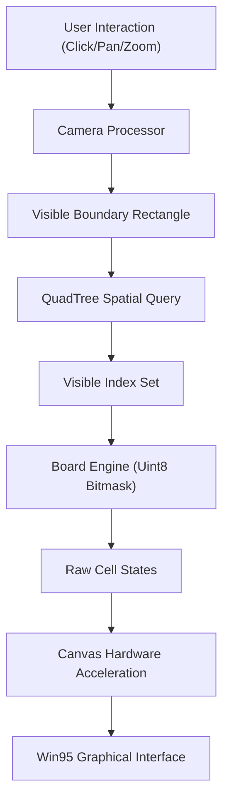

# Technical Specification: Minesweeper Engine

## Architectural Overview

**Minesweeper Engine** is a high-performance, zero-dependency web application designed to demonstrate advanced spatial partitioning and algorithmic optimization. The architecture prioritizes memory efficiency and low-latency rendering, enabling the simulation of grids exceeding 1,000,000 (1 million) nodes while maintaining a consistent 60 FPS delivery.

### Structural Data Flow

---

## Technical Implementations

### 1. Engine Architecture
-   **Memory Topology**: Implements a contiguous `Uint8Array` buffer to manage millions of cells. By utilizing bitwise masks (8-bits per cell), the engine achieves $O(1)$ attribute access while eliminating Garbage Collection overhead during massive board updates.
-   **Spatial Indexing**: Leverages a recursive **QuadTree** structure to partition 2D space. The renderer queries this tree using the viewport’s boundary rectangle to ensure only visible sectors are emitted to the graphics pipeline.

### 2. Logic & Inference
-   **Deterministic Generation**: Utilizes the **Mulberry32 PRNG** algorithm for seed-based board creation. This ensures that a given initial state is perfectly reproducible across different client environments.
-   **Recursive Uncloaking**: Employs an iterative **Breadth-First Search (BFS)** for flood-fill operations. This prevents the "Maximum Call Stack Size Exceeded" exceptions common in standard recursive implementations on large-scale maps.
-   **Constraint Satisfaction**: Integrates a custom **CSPSolver** (Constraint Satisfaction Problem) that validates board solvability. The solver eliminates forced 50/50 guessing scenarios by analyzing frontier variables against neighbor requirements.

### 3. Graphics & UI
-   **Virtualization Pipeline**: Utilizes an offscreen **SpriteSheet** generator to cache Win95 assets (bevels, digits, icons) in a single hardware-accelerated memory block, reducing draw-call latency.
-   **Win95 Shell Design**: Replicate the original Windows 95 visual language using CSS Custom Properties and asymmetric border-spacing to simulate light-source origins. The interface is optimized as a **PWA**, supporting offline execution and native desktop installation.
-   **Mobile Interaction Model**: Implemented a surgical touch-event matrix supporting single-tap (reveal), long-press (flag), and pinch-to-zoom/drag-to-pan gestures. Visual components dynamically rescale via `@media` queries, ensuring the classic 95 aesthetic remains accessible on modern mobile viewports.

### 4. Branding & Signature
-   **Scholarly Attribution**: Integrates a persistent developer signature within the source code and a styled, high-visibility branding block in the browser developer console. This signature links the technical execution (QuadTree partitioning, BFS traversal) directly to the author's professional profile and repository.

---

## Technical Prerequisites

-   **Runtime Environment**: Modern Evergreen Browser (Chrome 90+, Firefox 88+, Safari 14.1+) with ES6 Module and Canvas support.
-   **Asset Requirements**: Zero external dependencies; all logic and graphical assets are bundled within the primary source repository.

---

*Technical Specification | Vanilla JS | Version 1.0*
